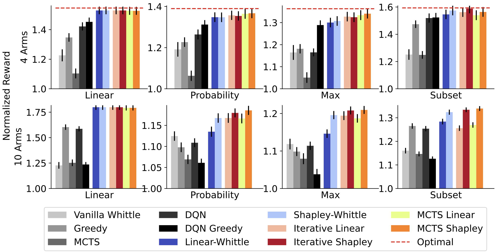

# Restless Bandits with Global Rewards and Applications to Food Rescue


This repository contains the implementation for the paper ["Restless Bandits with Global Rewards and Applications to Food Rescue"](https://arxiv.org/abs/2406.00738), published at NeurIPS 2024.

This work was done by [Naveen Raman](https://naveenraman.com/), [Ryan Shi](https://ryanzshi.github.io), [Sean Hudson](https://www.linkedin.com/in/sean-hudson-ba9b8759/), [Ameesh Kapoor](https://www.linkedin.com/in/ameeshkapoor/), and [Fei Fang](https://feifang.info). 

#### TL;DR 

Despite the successful application of restless bandits to real-world applications, a key limiting assumption is the separability of rewards into a sum across arms. 
We address this deficiency by proposing restless-multi-armed bandit with global rewards, a generalization of resltess bandits to global non-separable rewards. 
We develop a set of policies by extending Whittle indices and prove approximation  bounds for these policies. 
Empirically, we demonstrate that our proposed policies outperform baselines with synthetic data and demonstrate how methodological improvements can improve trip completion rate in food rescue

## Citation
If you use our code for your research, please cite this as
```
@article{raman2024global,
  title={Global Rewards in Restless Multi-Armed Bandits},
  author={Raman, Naveen and Shi, Ryan and Fang, Fei},
  journal={arXiv preprint arXiv:2406.00738},
  year={2024}
}
```
## Setup

#### Installation
To run experiments with global restless bandits, first clone this repository

```$ git clone https://github.com/naveenr414/food-rescue-rmab``` 

Then to install the dependencies run the following
```
$ conda env create --file environment.yaml
$ python install -e .
$ bash scripts/bash_scripts/create_folders.sh
```

This will create a new environment, called `food`, from which to run the code
To test whether the installation was successful, run 
```import rmab```

#### Evaluating Policies
To evaluate policies, run the `scripts/notebooks/All Policies.ipynb` notebook. 
This notebook evaluates all policies based on a set of parameters, and writes results to the `results/${out_folder}` folder, where out_folder is a parameter. 
For example, to run the random_policy, you can run the following: 
```
import random 
import numpy as np
from rmab.simulator import run_multi_seed

def random_policy(env,state,budget,lamb,memory, per_epoch_results):
    """Random policy that randomly notifies budget arms
    
    Arguments:
        env: Simulator environment
        state: Numpy array with 0-1 states for each agent
        budget: Integer, max agents to select
        lamb: Lambda, float, tradeoff between matching vs. activity
        memory: Any information passed from previous epochs; unused here
        per_epoch_results: Any information computed per epoch; unused here
    
    Returns: Actions, numpy array of 0-1 for each agent, and memory=None"""


    N = len(state)
    selected_idx = random.sample(list(range(N)), budget)
    action = np.zeros(N, dtype=np.int8)
    action[selected_idx] = 1

    return action, None

seed_list=[43]
policy=random_policy
episode_len=50
n_episodes=5
parameters={'seed': 43,
  'n_arms': 10,
  'volunteers_per_arm': 1,
  'budget': 5,
  'discount': 0.9,
  'alpha': 3,
  'n_episodes': n_episodes,
  'episode_len': episode_len,
  'n_epochs': 1,
  'lamb': 0,
  'prob_distro': 'uniform',
  'reward_type': 'probability',
  'universe_size': 20,
  'arm_set_low': 0,
  'arm_set_high': 1,
  'time_limit': 100,
  'recovery_rate': 0}
rewards, memory, simulator = run_multi_seed(seed_list,policy,parameters,test_length=episode_len*n_episodes)
print(np.mean(rewards['reward']))
```

#### Re-Running Experiments
All bash scripts for experiments can be found in the `scripts/bash_scripts/main_scripts` folder. 
To run all the experiments, run `bash scripts/bash_scripts/main_scripts/run_all_experiments.sh`

#### Running custom policies
To run custom policies, define a function that takes in an environment and a state, then returns an action
For example, to define the random policy: 
```
def random_policy(env,state,budget,lamb,memory, per_epoch_results):
    """Random policy that randomly notifies budget arms
    
    Arguments:
        env: Simulator environment
        state: Numpy array with 0-1 states for each agent
        budget: Integer, max agents to select
        lamb: Lambda, float, tradeoff between matching vs. activity
        memory: Any information passed from previous epochs; unused here
        per_epoch_results: Any information computed per epoch; unused here
    
    Returns: Actions, numpy array of 0-1 for each agent, and memory=None"""


    N = len(state)
    selected_idx = random.sample(list(range(N)), budget)
    action = np.zeros(N, dtype=np.int8)
    action[selected_idx] = 1

    return action, None
```